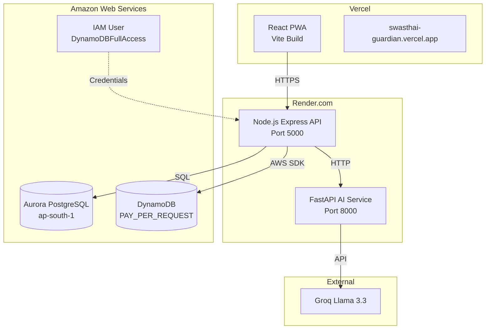

# Production Deployment Guide

## Introduction

This document provides comprehensive deployment instructions for SwasthAI Guardian across all environments — from local development with Docker to full production deployment on AWS, Vercel, and Render.com. The production setup runs entirely within the **AWS Free Tier** for zero-cost evaluation.

---

## Deployment Architecture



---

## Quick Start (Docker — Local Development)

```bash
cp .env.example .env
docker-compose up --build
```

| URL | Service |
|-----|---------|
| `http://localhost` | React PWA (served via Nginx) |
| `http://localhost:5000` | Node.js Express API |
| `http://localhost:8000` | FastAPI AI Service |

---

## Production Deployment

### Phase 1: AWS Database Provisioning

#### 1.1 Amazon Aurora PostgreSQL

1. Sign in to the [AWS Management Console](https://aws.amazon.com/console/).
2. Search for **RDS** and click the service.
3. Click **Create database**.
4. Choose **Standard create** → **Aurora (PostgreSQL Compatible)**.
5. Under **Templates**, select **Dev/Test**.
6. **Settings**:
   - **DB cluster identifier**: `swasthai-cluster`
   - **Master username**: `postgres`
   - **Master password**: Set a strong password.
7. **Instance configuration**:
   - Select **Serverless v2**.
   - Set Capacity range: **Minimum ACUs = 0.5**, **Maximum ACUs = 1.0**.
8. **Connectivity**:
   - **Publicly accessible**: Select **Yes**.
   - **VPC security group**: Create new → `swasthai-db-security-group`.
9. Click **Create database**.
10. Once available, copy the **Writer Endpoint** URL.

**Configure Security Group:**
1. Open the VPC Security Group.
2. **Inbound rules** → **Edit inbound rules**.
3. Add rule: Type = **PostgreSQL**, Port = `5432`, Source = **Anywhere-IPv4** (`0.0.0.0/0`).

Connection string:
```
postgresql://postgres:<your_password>@<your-aurora-writer-endpoint>:5432/postgres
```

#### 1.2 DynamoDB Tables

Create the following 5 tables in **ap-south-1** (Mumbai):

**1. `outbreak_telemetry`**
- Partition key: `villageId` (String)
- Sort key: `detectedAt` (String)
- GSI 1: `disease-index` (PK: `disease`, SK: `detectedAt`)
- GSI 2: `district-time-index` (PK: `districtId`, SK: `detectedAt`)

**2. `sync_queues`**
- Partition key: `deviceId` (String)
- Sort key: `queuedAt` (String)
- GSI: `status-index` (PK: `status`, SK: `queuedAt`)

**3. `village_node_state`**
- Partition key: `villageId` (String)
- TTL attribute: `expiresAt`

**4. `emergency_streams`**
- Partition key: `districtId` (String)
- Sort key: `streamId` (String)
- GSI 1: `priority-index` (PK: `priority`, SK: `streamId`)
- GSI 2: `district-date-index` (PK: `districtDateBucket`, SK: `timestamp`)

**5. `security_audit_logs`**
- Partition key: `actor` (String)
- Sort key: `timestamp` (String)
- No GSIs. No TTL (retained indefinitely).

#### 1.3 IAM Access Credentials

1. IAM → **Users** → **Create user** → `swasthai-app-user`.
2. Attach policy: **AmazonDynamoDBFullAccess**.
3. Create access key (application running outside AWS).
4. Save the **Access key ID** and **Secret access key**.

---

### Phase 2: Render (Backend + AI Service)

#### 2.1 AI Service (FastAPI)

1. Go to [Render.com](https://render.com/) → **New +** → **Web Service**.
2. Connect your GitHub repository.
3. **Configuration**:
   - **Name**: `swasthai-ai-service`
   - **Environment**: `Python3`
   - **Root Directory**: `ai-service`
   - **Build Command**: `pip install -r requirements.txt`
   - **Start Command**: `uvicorn main:app --host 0.0.0.0 --port $PORT`
4. **Environment Variables**:
   - `GROQ_API_KEY`: `<your_groq_api_key>`
   - `AGENT_SECRET`: `<create_a_random_32_char_string>`
5. Click **Create Web Service**.

#### 2.2 Backend API (Node.js Express)

1. **New +** → **Web Service**.
2. **Configuration**:
   - **Name**: `swasthai-backend`
   - **Environment**: `Node`
   - **Root Directory**: `backend`
   - **Build Command**: `npm install`
   - **Start Command**: `npm start`
3. **Environment Variables**:
   - `DATABASE_URL`: PostgreSQL connection string from RDS
   - `AWS_REGION`: `ap-south-1`
   - `AWS_ACCESS_KEY_ID`: IAM access key
   - `AWS_SECRET_ACCESS_KEY`: IAM secret key
   - `GROQ_API_KEY`: Same as AI service
   - `AI_SERVICE_URL`: `https://swasthai-ai-service.onrender.com`
   - `AGENT_SECRET`: Same as AI service
   - `JWT_SECRET`: Random 32-char string
   - `AADHAAR_SALT`: Random 32-char string
   - `NODE_ENV`: `production`
   - `ALLOWED_ORIGINS`: `*` or Vercel domain
4. Click **Create Web Service**.
5. After deployment, run seed: Shell tab → `node seed.js`

---

### Phase 3: Vercel (Frontend)

1. Sign in to [Vercel](https://vercel.com/).
2. **Add New** → **Project**.
3. Import your GitHub repository.
4. **Configuration**:
   - **Framework Preset**: `Vite`
   - **Root Directory**: `frontend`
5. **Environment Variables**:
   - `VITE_API_URL`: `https://swasthai-backend.onrender.com/api`
6. Click **Deploy**.

---

## Environment Variables Reference

| Variable | Required | Service | Description |
|----------|----------|---------|-------------|
| `DATABASE_URL` | Yes | Backend | PostgreSQL connection string |
| `JWT_SECRET` | Yes | Backend | 32-char random string for JWT signing |
| `AADHAAR_SALT` | Yes | Backend | 32-char random string for Aadhaar hashing |
| `AGENT_SECRET` | Yes | Both | Shared secret for outbreak agent auth |
| `GROQ_API_KEY` | Yes | AI | API key for Groq LLM access |
| `AI_SERVICE_URL` | Yes | Backend | URL of the deployed AI service |
| `AWS_REGION` | Yes | Backend | `ap-south-1` |
| `AWS_ACCESS_KEY_ID` | Yes | Backend | IAM access key |
| `AWS_SECRET_ACCESS_KEY` | Yes | Backend | IAM secret key |
| `ALLOWED_ORIGINS` | No | Backend | Comma-separated CORS origins |
| `ALLOW_DEMO_OTP` | No | Backend | Never enable in production |
| `VITE_API_URL` | Yes | Frontend | Backend API URL with `/api` suffix |

---

## Best Practices

### Security
- **Never enable `ALLOW_DEMO_OTP` in production**
- Rotate `JWT_SECRET`, `AADHAAR_SALT`, and `AGENT_SECRET` quarterly
- Use unique secrets per deployment environment (dev/staging/prod)
- Restrict `ALLOWED_ORIGINS` to specific domains in production
- Enable Helmet.js with strict Content Security Policy
- Use IAM roles instead of access keys where possible (Render IAM integration)
- Enable Aurora automated backups with 7-day retention

### Performance
- Set `NODE_CLUSTER_WORKERS` based on available CPU cores (default: 1 on free tier)
- Deep model (`ENABLE_DEEP_MODEL`) disabled by default on free tier (512MB RAM limit)
- DynamoDB PAY_PER_REQUEST billing auto-scales — no capacity planning needed
- Enable HTTP/2 on Vercel for reduced latency
- Use image compression before upload (<200KB target)

### Reliability
- **Health checks**: All services include readiness probes
- **Auto-restart**: Render and Vercel auto-restart on crash
- **Database retry**: 3-attempt exponential backoff for all DB operations
- **DLQ**: Failed events captured for manual replay
- **Cluster mode**: Production uses Node.js cluster for multi-core utilization

### Monitoring
- Use `/api/health/detailed` for comprehensive stack health
- Monitor DynamoDB consumed capacity and throttle events
- Set up Render and Vercel deployment notifications
- Enable AWS CloudWatch alarms for Aurora and DynamoDB

---

## Maintenance

### Database Migrations
Schema migrations run automatically on application startup via dynamic `ALTER TABLE` operations. To add a new column:
1. Add the column definition to `backend/db/schema.js`
2. Deploy the update — migration runs automatically

### Updating AI Models
```bash
cd ai-service
python train_disease_model.py     # Retrain Logistic Regression
python train_deep_model.py        # Retrain SymptomNet MLP
python calibrate_rag.py           # Recalibrate RAG threshold
```

### Backup & Recovery
- Aurora: Automated backups with 7-day retention
- DynamoDB: On-demand backups via AWS console
- Application state: Idempotent replay from IndexedDB sync queues

---

## Future Improvements

- [ ] Infrastructure as Code (Terraform) for repeatable AWS provisioning
- [ ] GitHub Actions CI/CD pipeline with staging → production promotion
- [ ] Blue-green deployment strategy on Render for zero-downtime updates
- [ ] AWS CloudFront CDN for static asset delivery
- [ ] Database connection pooling with PgBouncer for Aurora
- [ ] Automated DynamoDB backup to S3 with lifecycle policies
- [ ] Multi-region disaster recovery (active-passive)
- [ ] Container orchestration with AWS ECS Fargate (beyond Render)
- [ ] Secrets management with AWS Secrets Manager or HashiCorp Vault
- [ ] Performance and load testing suite for deployment validation

---

> For local development setup with detailed environment variable documentation, see [Setup Guide](docs/setup_guide.md).
