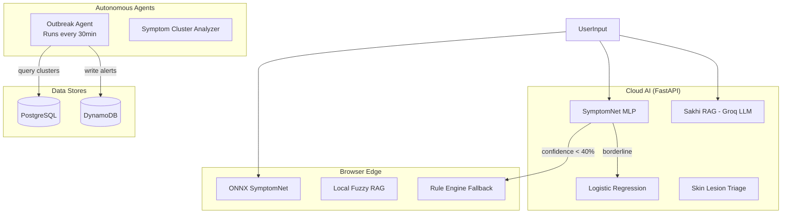
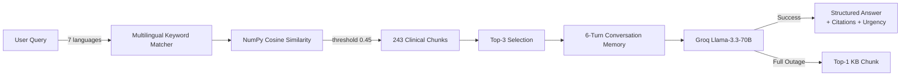

# AI System

## Introduction

SwasthAI Guardian's AI system is a **hybrid edge-to-cloud intelligence platform** designed for clinical reliability in low-connectivity rural settings. It combines browser-side neural inference, cloud-based LLM reasoning, and autonomous agentic loops to deliver diagnostic assistance, clinical guidance, and outbreak detection — all while maintaining safety guarantees when confidence is low.

---

## System Architecture

---

## AI Components

### 1. Hybrid Diagnostic Engine

A tiered ensemble approach ensures clinical safety:

| Tier | Component | Method | Accuracy | Role |
|------|-----------|--------|----------|------|
| **Primary** | SymptomNet | Deep Learning MLP with multilingual Transformer embeddings | 64.6% | Deep semantic understanding of symptoms in 7 languages |
| **Secondary** | Logistic Regression | Multinomial TF-IDF classifier with balanced class weights | 71.1% | Cross-verification when neural confidence is borderline |
| **Safety** | Rule Engine | MoHFW/WHO protocol-based rules | — | Fallback when all model confidences < 40% |
| **Edge** | ONNX SymptomNet | Browser-side compiled model (<1ms inference) | — | Fully offline operation |

**Model Specifications:**
- **Dataset:** 52,900 high-quality samples across 7 languages (English, Hindi, Hinglish, Marathi, Tamil, Telugu, Bengali)
- **Classes:** 101 distinct disease states covering the full spectrum of rural India's disease burden
- **Evaluation:** 5-Fold Stratified Cross-Validation + 15% independent hold-out test set
- **Inference Latency:** <2.5s on standard CPU (no GPU required)

### 2. Sakhi RAG (Retrieval-Augmented Generation)

Sakhi is a memory-aware, grounded clinical assistant designed for zero-hallucination responses:

**Knowledge Base:**
- 243 clinical knowledge chunks from WHO and MoHFW guidelines
- 2-sentence sliding-window overlap for context continuity
- 15+ clinical source categories including:
  - WHO Reproductive Health Guidelines 2022
  - MoHFW ASHA Training Modules 6 & 7
  - FOGSI Clinical Protocols 2023
  - ICMR Anaemia & PCOS Guidelines
  - UNICEF Maternal Nutrition Framework
  - NHM India Menstrual Hygiene Scheme
  - NVBDCP / NTEP disease management protocols

**Calibration:**
- Retrieval threshold: **0.45** (raised from 0.28 after 50-query precision/recall grid search)
- F1 score at threshold: **1.00** (precision=1.00, recall=1.00)
- 6-turn conversation memory maintained in localStorage + server session

### 3. Autonomous Outbreak Agent

A background daemon that runs every 30 minutes:

1. **Query** PostgreSQL for village symptom clusters
2. **Analyze** cluster JSON using Groq Llama-3.3-70B (JSON mode, 3-attempt exponential backoff)
3. **Deduplicate** against DynamoDB (no duplicate alerts for same village in 24h)
4. **Alert** via POST to `/api/admin/outbreak-alert` (requires `AGENT_SECRET`)
5. **Broadcast** to all connected admin dashboards via Server-Sent Events (SSE)

### 4. On-Device Intelligence

| Component | Technology | Latency | Function |
|-----------|-----------|---------|----------|
| SymptomNet ONNX | ONNX Runtime (opset 18) | <1ms | Browser-side disease classification |
| Local RAG | Fuzzy token-weighted search in IndexedDB | <50ms | Offline guideline retrieval |
| Offline Auth | SHA-256 credential hashing | <10ms | Secure offline login |

### 5. Skin Lesion Triage

The `skin_analyzer.py` module provides image-based skin condition analysis with severity assessment, running on device-compressed images (<200KB).

---

## Safety & Guardrails

### Clinical Safety
- **Confidence floor of 40%**: If both SymptomNet and Logistic Regression fall below 40%, the system refuses to guess — it falls back to verified MoHFW/WHO first-aid instructions
- **RAG threshold**: Calibrated at 0.45 (F1=1.00) — no irrelevant knowledge chunks reach the LLM
- **3-attempt exponential backoff**: Groq API calls retry at 1s → 2s → 4s intervals; on full outage, top-1 KB chunk served as fallback

### Content Safety
- **Text guardrails**: Input/output validation prevents harmful or misleading medical advice
- **PII redaction**: Patient identifiers stripped from AI conversation traces
- **Rate limiting**: AI endpoints limited to 10 requests per minute per user

### Validation
- 5-Fold Stratified Cross-Validation ensures every disease class appears in validation sets
- Independent hold-out test set of ~7,935 samples (15% of dataset) used for final benchmark
- Per-class precision, recall, and F1 scores logged to training output files

---

## Best Practices

### Model Development
- Use `StratifiedKFold` with `random_state=42` for reproducible splits
- Pre-compute Transformer embeddings before folding (MLP trains on embeddings, not raw text)
- Log CV scores as `mean ± std` across all 5 folds
- Evaluate on independent hold-out set before deployment

### RAG Configuration
- Tune retrieval threshold using precision-recall grid search on a held-out query set
- Use sliding-window chunk overlap (2 sentences) to preserve context boundaries
- Maintain conversation memory last 6 turns only to bound context window costs
- Always serve a fallback answer on LLM outage (never a silent failure)

### Deployment
- Deep model disabled by default on free-tier hosting (512MB RAM limit)
- Set `ENABLE_DEEP_MODEL=true` in `.env` for local deployment with full MLP
- ONNX weights lazy-loaded in browser to optimize initial page load

---

## Future Improvements

### Short-term
- [ ] Add model versioning and A/B testing framework
- [ ] Implement automated retraining pipeline with new symptom data
- [ ] Expand language support to all 22 scheduled Indian languages
- [ ] Add confidence calibration using Platt scaling

### Medium-term
- [ ] Implement federated learning across district deployments for privacy-preserving improvement
- [ ] Add differential privacy to model training
- [ ] Develop specialized pediatric and geriatric diagnostic models
- [ ] Integrate chest X-ray and ultrasound AI triage

### Long-term
- [ ] Real-time epidemic simulation engine using agent-based modeling
- [ ] Multi-modal AI combining symptoms + vitals + imaging
- [ ] Continuous learning from closed-loop referral outcomes
- [ ] On-device LLM distillation for fully offline advanced reasoning

---

> For detailed AI methodology including 5-fold stratified CV results, RAG calibration methodology, and the full 101-disease class list, see [AI Architecture](ai_architecture.md).
