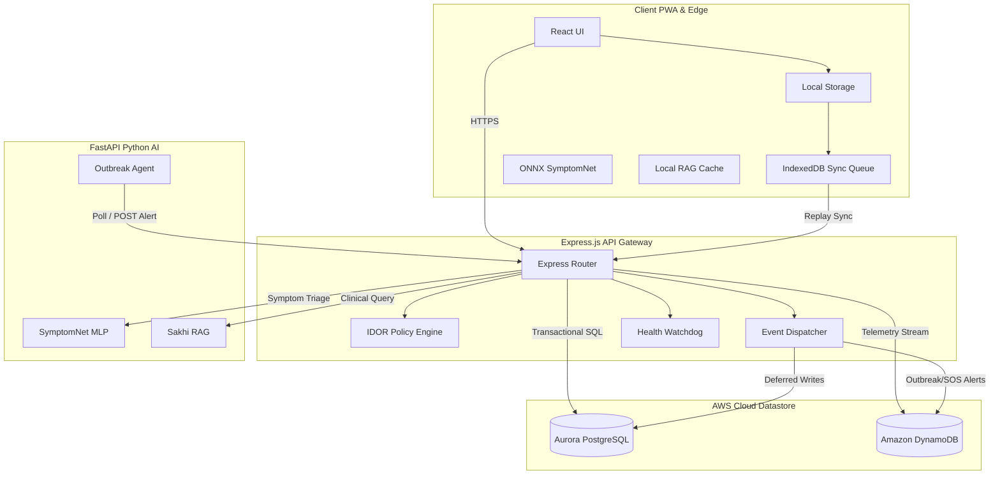
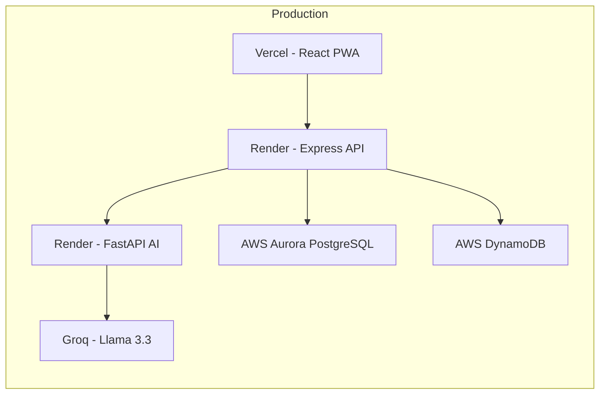

# Architecture

## Introduction

SwasthAI Guardian is built as a **decoupled, offline-first, three-tier architecture** designed for rural healthcare environments where internet connectivity is intermittent or unavailable. The platform combines edge intelligence on the client with cloud-based AI and storage services, ensuring clinical workflows continue uninterrupted during network outages.

This document describes the high-level system architecture, component interactions, deployment topology, best practices, and planned improvements.

---

## High-Level Architecture

---

## Component Architecture

### 1. Client Edge (React PWA)

The frontend is a **Progressive Web Application** built with React and Vite, deployed on Vercel. It is the primary interface for ASHA workers, villagers, and administrators.

**Key capabilities:**
- Runs fully offline using IndexedDB for local data storage
- Executes ONNX-compiled SymptomNet for browser-side AI inference (<1ms)
- Maintains a local fuzzy RAG cache for offline clinical guideline retrieval
- Compresses medical images to <200KB on-device for 2G uploads
- Supports 7 Indian languages with on-the-fly switching
- Uses SHA-256 hashing for secure offline credential verification

### 2. Backend Gateway (Express.js)

The backend is a **Node.js Express API** deployed on Render.com. It serves as the unified REST API gateway and event bus.

**Key capabilities:**
- JWT-based authentication with role-based access control (villager, ngo, admin)
- Centralized IDOR policy engine for village-scoped data isolation
- Asynchronous Event Dispatcher with 3-attempt retry loop
- Server-Sent Events (SSE) for real-time admin dashboard updates
- Dead Letter Queue (DLQ) for failed event payloads
- Health Watchdog that scans microservice health every 30 seconds
- Seamless SQLite/PostgreSQL switching based on environment

### 3. AI Microservice (FastAPI)

The AI service is a **Python FastAPI** application deployed on Render.com. It hosts all machine learning models and autonomous agents.

**Key capabilities:**
- SymptomNet deep learning MLP for disease classification (101 classes)
- Logistic Regression fallback classifier (71.1% hold-out accuracy)
- Sakhi RAG engine with 243 clinical knowledge chunks
- Autonomous Outbreak Agent that scans for disease clusters every 30 minutes
- Skin lesion triage using image analysis
- 3-attempt exponential backoff for external API calls (Groq LLM)

### 4. Cloud Datastore (AWS)

The platform uses a **dual-database strategy** on AWS:

| Database | Purpose | Access Pattern |
|----------|---------|----------------|
| Amazon Aurora PostgreSQL | Relational system of record | ACID transactions, complex JOINs |
| Amazon DynamoDB | Time-series telemetry | High-throughput append-only streams |

---

## Data Flow

### Online Mode
1. Client sends API requests via HTTPS to the Express backend
2. Backend validates auth, applies IDOR policy, routes to handler
3. Relational data (users, symptoms, reports) → Aurora PostgreSQL
4. Telemetry data (outbreak alerts, sync logs) → DynamoDB
5. AI requests proxied to FastAPI service

### Offline Mode
1. Client actions queued in IndexedDB transactional sync queue
2. ONNX SymptomNet runs locally for disease inference
3. Local RAG cache serves clinical guideline queries
4. On reconnect, queue replays with idempotency keys → zero duplication

### Autonomous Outbreak Loop
1. Outbreak Agent queries PostgreSQL for symptom clusters (every 30 min)
2. Sends cluster data to Groq Llama-3.3-70B for classification
3. If confidence ≥ 70%, checks DynamoDB for duplicate alerts
4. POSTs alert to backend → backend writes to DynamoDB → SSE broadcast to admins

---

## Deployment Topology

---

## Best Practices

### Architecture
- **Offline-first by default**: Every feature must work without connectivity before cloud features are added
- **Idempotent operations**: All writes use `client_request_id` as idempotency key to prevent duplicates
- **Decoupled writes**: Event Dispatcher separates synchronous CRUD from asynchronous telemetry
- **Graceful degradation**: AI service failures fall back to local models or rule-based engines
- **Stateless backend**: All session state lives in JWTs or the client; backend scales horizontally

### Security
- **Defense in depth**: Helmet.js + CORS + rate limiting + input validation (Zod) + IDOR policy
- **PII redaction**: All logging layers automatically redact sensitive fields
- **Secrets management**: No hardcoded secrets; all via environment variables
- **SQL injection prevention**: Parameterized queries throughout

### Performance
- **Connection pooling**: PostgreSQL pool with configurable max connections
- **DynamoDB PAY_PER_REQUEST**: Auto-scales with zero provisioning
- **Client-side compression**: Images compressed before upload
- **Lazy-loaded ONNX weights**: Downloaded only when offline mode is activated

---

## Future Improvements

### Short-term
- [ ] Add CDN caching layer for static AI model assets
- [ ] Implement Redis caching for frequently accessed clinical data
- [ ] Add circuit breaker pattern for external API calls (beyond retry loop)

### Medium-term
- [ ] Migrate to WebSocket for real-time sync instead of periodic polling
- [ ] Implement horizontal auto-scaling for Express backend
- [ ] Add read replicas for Aurora PostgreSQL for reporting queries

### Long-term
- [ ] Edge compute (CloudFlare Workers / Lambda@Edge) for low-latency API routing
- [ ] Multi-region AWS deployment with active-passive failover
- [ ] Service mesh (Istio/Linkerd) for inter-service observability
- [ ] Federated learning across district clusters for privacy-preserving model improvement

---

> For detailed system design including database schemas, DynamoDB table definitions, and production hardening details, see [System Architecture](system_architecture.md).
