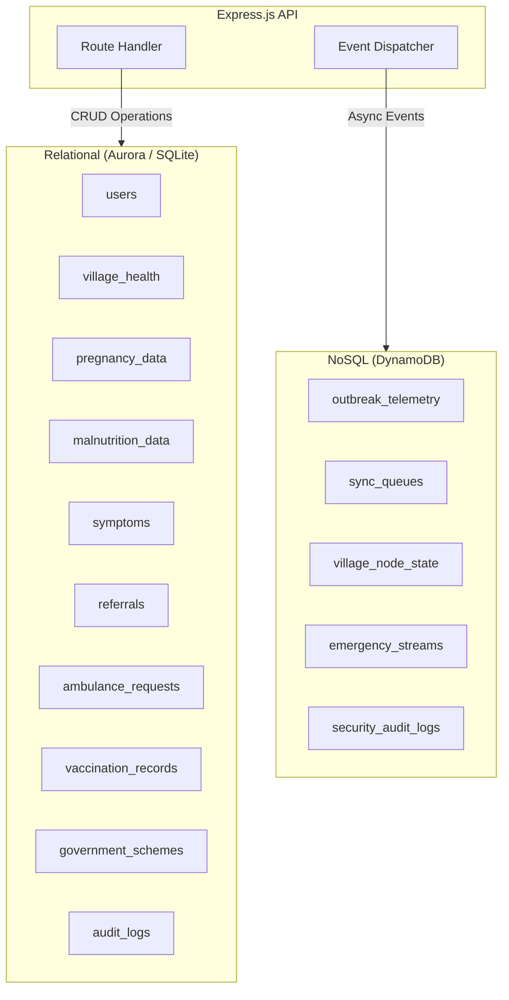
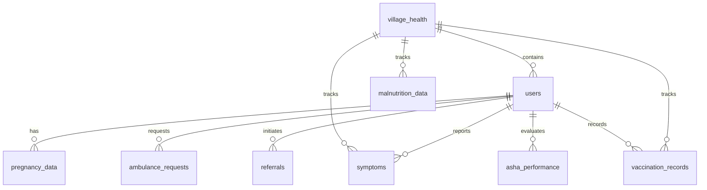

# Database Design

## Introduction

SwasthAI Guardian employs a **dual-database architecture** that deliberately separates concerns:

- **Amazon Aurora PostgreSQL** for ACID-compliant relational data (patient records, clinical profiles)
- **Amazon DynamoDB** for high-throughput telemetry and event streams (outbreak alerts, sync logs)

A **SQLite** fallback is used in local development, with the exact same schema structure as Aurora, enabling zero-configuration setup.

---

## Database Strategy

| Criteria | Aurora PostgreSQL | DynamoDB |
|----------|------------------|----------|
| **Role** | System of record | Event & telemetry store |
| **Data** | Users, pregnancies, symptoms, referrals | Outbreak alerts, sync queues, emergencies |
| **Consistency** | ACID transactions | Eventual (with conditional writes) |
| **Access Pattern** | Complex JOINs, aggregations | Key-value lookups, time-series queries |
| **Scaling** | Vertical (read replicas) | Horizontal (PAY_PER_REQUEST) |
| **Billing** | Provisioned capacity | On-demand, auto-scaling |



---

## Aurora PostgreSQL Schema

### Entity Relationship Diagram



### Tables

#### `village_health`
| Column | Type | Description |
|--------|------|-------------|
| villageId | VARCHAR(60) PK | Unique village identifier |
| name | VARCHAR(120) | Village name |
| population | INTEGER | Village population |
| pregnant_women | INTEGER | Count of pregnant women |
| children_under_5 | INTEGER | Count of children under 5 |
| malnutrition_cases | INTEGER | Malnutrition case count |
| asha_contact | VARCHAR(20) | ASHA worker phone |
| outbreakAlert | TEXT | Current outbreak alert |
| districtId | VARCHAR(80) | District identifier |
| lat / lng | DOUBLE | Geographic coordinates |

#### `users`
| Column | Type | Description |
|--------|------|-------------|
| id | SERIAL PK | Auto-increment ID |
| phone | VARCHAR(20) UNIQUE | Phone number (login identifier) |
| email | VARCHAR(120) UNIQUE | Email address |
| username | VARCHAR(80) | Display username |
| name | VARCHAR(120) | Full name |
| password | VARCHAR(255) | BCrypt-hashed password |
| role | VARCHAR(20) | `villager`, `ngo`, or `admin` |
| villageId | VARCHAR(60) FK | References village_health |
| gender / age | VARCHAR / INTEGER | Demographics |
| economic_status / caste / area_type | VARCHAR | Scheme eligibility |
| aadhaar_hash | VARCHAR(64) | SHA-256 salted hash |
| aadhaar_masked | VARCHAR(20) | Last 4 digits only |

#### `pregnancy_data`
| Column | Type | Description |
|--------|------|-------------|
| id | SERIAL PK | Auto-increment |
| name | VARCHAR(120) | Patient name |
| age | INTEGER | Patient age |
| trimester | INTEGER | 1, 2, or 3 |
| riskLevel | VARCHAR(20) | `low`, `medium`, `high` |
| villageId | VARCHAR(60) | Village reference |
| systolic_bp / diastolic_bp | INTEGER | Blood pressure |
| bs | DOUBLE | Blood sugar |
| body_temp | DOUBLE | Body temperature |
| heart_rate | INTEGER | Heart rate (BPM) |
| client_request_id | VARCHAR(120) UNIQUE | Idempotency key |

#### `symptoms`
| Column | Type | Description |
|--------|------|-------------|
| id | SERIAL PK | Auto-increment |
| userId | INTEGER FK | Reporting user |
| villageId | VARCHAR(60) | Village reference |
| symptoms | TEXT | Raw symptom description |
| disease | VARCHAR(120) | Predicted disease |
| confidence | REAL | Model confidence score |
| model_used | VARCHAR(50) | `symptomnet` or `logistic_regression` |
| advice | TEXT | Clinical advice |
| client_request_id | VARCHAR(120) UNIQUE | Idempotency key |

#### Additional tables
- `otps` — OTP codes for phone login
- `refresh_tokens` — JWT refresh tokens with expiry
- `revoked_tokens` — Blacklisted tokens
- `malnutrition_data` — Child malnutrition assessments (WHO Z-scores)
- `skin_logs` — Skin condition analysis results
- `ambulance_requests` — SOS emergency requests
- `ngo_reports` — NGO-generated reports
- `government_schemes` — 20+ health schemes with eligibility criteria
- `referrals` — Patient referrals with outcome tracking
- `village_bulk_uploads` — Bulk CSV upload audit trail
- `twilio_receipts` — SMS delivery receipts
- `vaccination_records` — Immunization tracking (Mission Indradhanush)
- `asha_performance` — Monthly ASHA worker KPIs
- `audit_logs` — Security and compliance audit trail
- `district_config` — Per-district configuration

### Indexes

```sql
-- Performance indexes for common query patterns
CREATE INDEX idx_symptoms_villageid ON symptoms("villageId");
CREATE INDEX idx_symptoms_userid ON symptoms("userId");
CREATE INDEX idx_symptoms_createdat ON symptoms("createdAt");
CREATE INDEX idx_ambulance_status ON ambulance_requests(status);
CREATE INDEX idx_pregnancy_village ON pregnancy_data("villageId");
CREATE INDEX idx_referrals_status ON referrals(status);

-- Idempotency partial unique indexes
CREATE UNIQUE INDEX idx_symptoms_client_request
  ON symptoms(client_request_id) WHERE client_request_id IS NOT NULL;
CREATE UNIQUE INDEX idx_ambulance_client_request
  ON ambulance_requests(client_request_id) WHERE client_request_id IS NOT NULL;
```

---

## DynamoDB Schema

| Table | Partition Key | Sort Key | GSIs | TTL | Purpose |
|-------|---------------|----------|------|-----|---------|
| `outbreak_telemetry` | villageId | detectedAt | disease-index, district-time-index | None | AI-detected outbreak events |
| `sync_queues` | deviceId | queuedAt | status-index | None | Offline sync queue management |
| `village_node_state` | villageId | — | None | expiresAt (7d) | Village heartbeat monitoring |
| `emergency_streams` | districtId | streamId | priority-index, district-date-index | None | Ambulance SOS event streams |
| `security_audit_logs` | actor | timestamp | None | None | Immutable audit trail |

### Key Design Decisions

**outbreak_telemetry:**
- `disease-index` GSI: Query outbreaks by disease type for trend analysis
- `district-time-index` GSI: Query outbreaks by district and time range for admin dashboard
- Atomic `UpdateCommand` prevents race conditions under concurrent agent writes

**sync_queues:**
- `status-index` GSI: Filter by `pending`, `processing`, or `failed` for admin monitoring
- Each queue entry tracks device, timestamp, and batch metadata

**emergency_streams:**
- `priority-index` GSI: Filter P1 (critical) emergencies for immediate dispatch
- `district-date-index` GSI: Chronological emergency timeline per district

**village_node_state:**
- TTL auto-expires stale village entries after 7 days
- Used for real-time village health monitoring dashboard

---

## Best Practices

### Schema Design
- **Idempotency keys** on all mutation tables prevent duplicate records from offline sync replay
- **Partial unique indexes** ensure idempotency without blocking NULL `client_request_id` values
- **Auto-migration** via dynamic `ALTER TABLE` on startup — schema evolves without manual migration scripts
- **Updated_at triggers** on every table maintain audit timestamps automatically

### Performance
- Aurora indexes cover the most frequent query patterns (village lookups, status filters, time-based queries)
- DynamoDB GSIs designed for specific access patterns, not generic scanning
- SQLite in development uses the same schema, indexes, and triggers as Aurora

### Security
- Aadhaar stored as salted SHA-256 hash, never plaintext
- Audit logs immutable with no TTL
- DynamoDB security_audit_logs use PK isolation (actor-based) to prevent cross-actor scanning

### Offline Sync
- `client_request_id` serves as global idempotency key across all mutation tables
- Partial unique indexes guarantee zero duplication even under concurrent replay
- Sync health logging tracks latency and pending counts in DynamoDB

---

## Future Improvements

- [ ] Add read replicas for Aurora PostgreSQL to offload reporting queries
- [ ] Implement DynamoDB Streams → Lambda for real-time event processing
- [ ] Add time-series optimized table for symptom trend analysis (TimescaleDB extension)
- [ ] Implement database migration tool (e.g., Flyway) for version-controlled schema changes
- [ ] Add Data Lifecycle Manager for automatic archival of records older than 7 years
- [ ] Implement connection pooling with PgBouncer for Aurora
- [ ] Add global secondary index on `symptoms.disease` for epidemiological queries
- [ ] Full-text search on symptoms using PostgreSQL tsvector

---

> For DynamoDB table creation instructions and production hardening details, see [System Architecture](system_architecture.md) and [Deployment Guide](../DEPLOYMENT.md).
