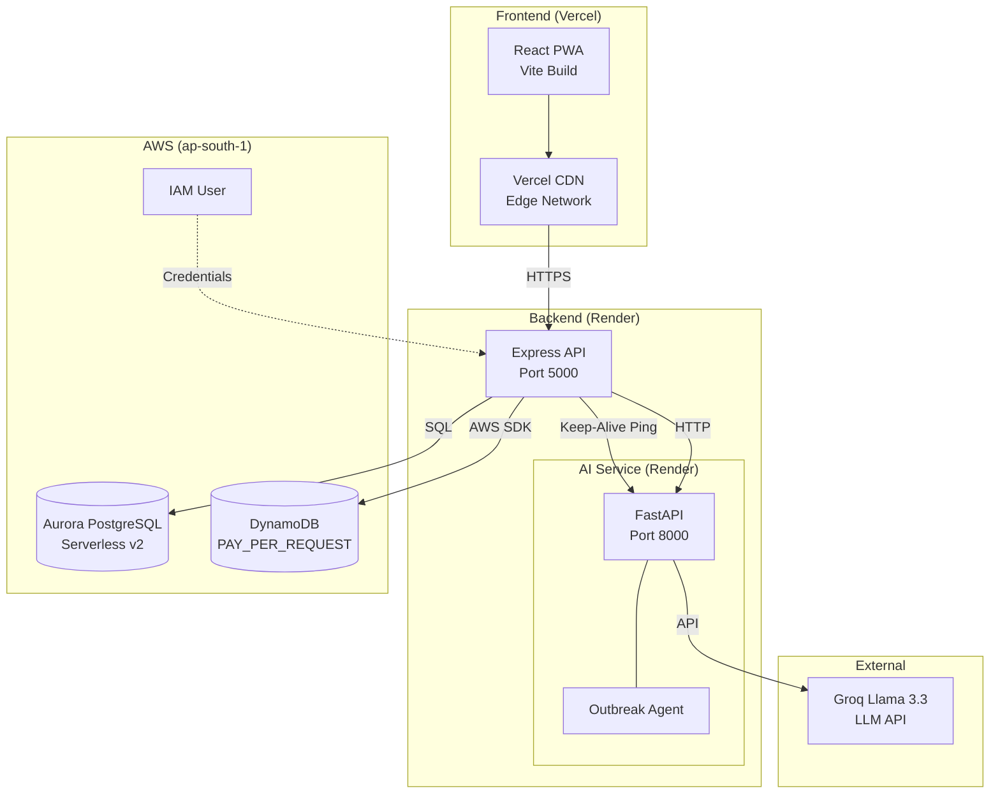
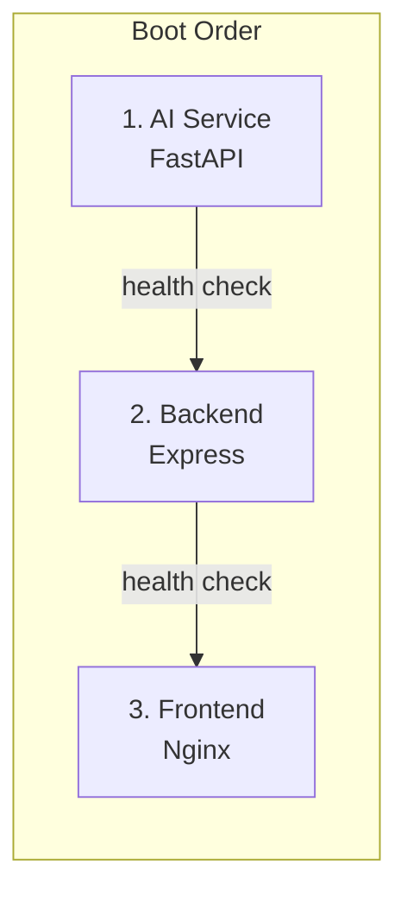

# Deployment Guide

## Introduction

This guide covers production deployment of SwasthAI Guardian across all environments. The architecture uses three hosting providers — **Vercel** (frontend), **Render** (backend + AI), and **AWS** (databases) — to maximize free-tier eligibility while maintaining production-grade reliability.

---

## Production Architecture



### Service Dependencies



---

## Health Check Endpoints

Every service exposes a health endpoint used by Docker, Render, and load balancers for readiness verification.

| Service | Endpoint | Response | Used By |
|---------|----------|----------|---------|
| AI Service | `GET /health` | `{"status": "online", "model_loaded": true}` | Docker, Backend keep-alive |
| Backend API | `GET /api/health` | `{"status": "ok", "db": "connected"}` | Docker, Render |
| Backend API | `GET /api/health/detailed` | Full stack health (DB, Dynamo, AI, uptime) | Admin dashboard, monitoring |
| Frontend | `GET /` | HTTP 200 + index.html | Vercel, browser |

---

## Frontend Deployment (Vercel)

### Prerequisites
- Node.js 20+
- A Vercel account (free tier sufficient)
- GitHub repository access

### Configuration

**Root Directory:** `frontend`

**Framework Preset:** Vite

**Build Command:** `npm run build`

**Output Directory:** `dist`

**Environment Variables:**

| Variable | Value | Purpose |
|----------|-------|---------|
| `VITE_API_URL` | `https://your-backend.onrender.com/api` | Backend API endpoint |

### vercel.json

The existing `frontend/vercel.json` configures:
- **API proxy rewrites** — forward `/api/*` requests to the backend Render URL
- **SPA fallback** — all non-api routes serve `index.html` for React Router
- **Security headers** — X-Content-Type-Options, X-Frame-Options, Permissions-Policy
- **Cache headers** — immutable caching for assets, 24h for icons

```json
{
  "rewrites": [
    { "source": "/api/(.*)", "destination": "https://your-backend.onrender.com/api/$1" },
    { "source": "/((?!api).*)", "destination": "/index.html" }
  ]
}
```

### Deployment Steps

1. Push code to GitHub
2. Go to [vercel.com](https://vercel.com) → **Add New** → **Project**
3. Import your repository
4. Set **Root Directory** to `frontend`
5. Add `VITE_API_URL` environment variable
6. Click **Deploy**

**Post-deployment:**
- Update `vercel.json` rewrite destination to your Render backend URL
- Enable **Vercel Analytics** for traffic monitoring
- Configure custom domain if needed

---

## Backend Deployment (Render)

### Prerequisites
- Node.js 20+
- A Render account (free tier sufficient)
- AWS database provisioned (see [AWS Setup](#aws-setup))

### Configuration

**Root Directory:** `backend`

**Runtime:** Node

**Build Command:** `npm install`

**Start Command:** `npm start`

### Environment Variables

| Variable | Required | Source | Description |
|----------|----------|--------|-------------|
| `NODE_ENV` | Yes | Static | Set to `production` |
| `PORT` | Yes | Render auto-set | Leave empty — Render sets this |
| `JWT_SECRET` | Yes | Generate | 32+ char random string |
| `AADHAAR_SALT` | Yes | Generate | 32+ char random string |
| `AGENT_SECRET` | Yes | Generate | 32+ char random string (shared with AI) |
| `GROQ_API_KEY` | Yes | Groq Console | API key for LLM inference |
| `AI_SERVICE_URL` | Yes | Render | e.g. `https://swasthai-ai.onrender.com` |
| `AWS_REGION` | Yes | Static | `ap-south-1` |
| `AWS_ACCESS_KEY_ID` | Yes | IAM | DynamoDB access key |
| `AWS_SECRET_ACCESS_KEY` | Yes | IAM | DynamoDB secret key |
| `DATABASE_URL` | Yes | RDS | Aurora PostgreSQL connection string |
| `ALLOWED_ORIGINS` | Yes | Static | Comma-separated frontend domains |
| `NODE_CLUSTER_WORKERS` | No | Config | `1` for free tier, up to `4` for paid |
| `ALLOW_DEMO_OTP` | No | — | **Never enable in production** |
| `ENABLE_DEEP_MODEL` | No | Config | `true` if RAM > 512MB available |

### Health Check Configuration

Render supports health check paths. Configure:

- **Health Check Path:** `/api/health`
- **Initial Delay:** 15 seconds
- **Check Interval:** 30 seconds

### Deployment Steps

1. In Render Dashboard → **New +** → **Web Service**
2. Connect your GitHub repository
3. Set **Name**: `swasthai-backend`
4. Set **Root Directory**: `backend`
5. Set **Build Command**: `npm install`
6. Set **Start Command**: `npm start`
7. Add all environment variables
8. Set **Health Check Path**: `/api/health`
9. Click **Create Web Service**

**Post-deployment:**
- Run seed data: Render Shell → `node seed.js`
- Verify health: `GET https://your-backend.onrender.com/api/health/detailed`
- Set up **Keep-Alive** (Render free tier sleeps after 15min of inactivity)

### Keep-Alive Strategy

The backend includes a built-in keep-alive pinger that hits the AI service `/health` endpoint every 60 seconds. For the frontend, use an external uptime monitor (e.g., UptimeRobot, Kuma) to ping your backend periodically.

---

## AI Service Deployment (Render)

### Prerequisites
- Python 3.11+
- Groq API key
- Render account

### Configuration

**Root Directory:** `ai-service`

**Runtime:** Docker (recommended) or Python

**Dockerfile:** The existing `ai-service/Dockerfile` handles:
- Python 3.11-slim base image
- System dependencies: `curl`, `gcc`
- Python dependencies from `requirements.txt`
- Dataset generation + model training at build time
- Non-root user (`swasthai`) for security
- Single worker Uvicorn server

### Environment Variables

| Variable | Required | Description |
|----------|----------|-------------|
| `GROQ_API_KEY` | Yes | Groq LLM API key |
| `AGENT_SECRET` | Yes | Shared secret with backend for outbreak alerts |
| `BACKEND_URL` | No | Render auto-set via `fromService` in `render.yaml` |

### Deployment via Docker (Recommended)

1. In Render Dashboard → **New +** → **Web Service**
2. Connect repository
3. Set **Name**: `swasthai-ai-service`
4. Set **Runtime**: `Docker`
5. **Docker Context**: `ai-service`
6. **Dockerfile Path**: `ai-service/Dockerfile`
7. Add environment variables
8. Click **Create Web Service**

### Deployment via Python (Alternative)

1. **New +** → **Web Service**
2. Set **Environment**: `Python 3`
3. Set **Root Directory**: `ai-service`
4. Set **Build Command**: `pip install -r requirements.txt`
5. Set **Start Command**: `uvicorn main:app --host 0.0.0.0 --port $PORT --workers 1`
6. Add environment variables
7. Click **Create Web Service**

### Important Notes

- **Model training runs at build time** — expect 3–5 minutes for `generate_dataset.py` + `train_disease_model.py`
- The deep model (`train_deep_model.py`) is **not** included in the Dockerfile to keep build time and RAM within free-tier limits
- The service uses Logistic Regression as the primary model (71.1% accuracy) on free tier
- Set `ENABLE_DEEP_MODEL=true` in backend env to enable SymptomNet MLP (requires ~500MB additional RAM)

---

## Docker Deployment

### docker-compose.yml

The existing `docker-compose.yml` orchestrates all three services:

| Service | Container Name | Port | Depends On | Health Check |
|---------|---------------|------|------------|--------------|
| `ai-service` | `swasthai_ai` | `8000` | — | `GET /health` (30s interval) |
| `backend` | `swasthai_backend` | `5000` | ai-service (healthy) | `GET /api/health` (30s interval) |
| `frontend` | `swasthai_frontend` | `80` | backend (healthy) | — |

### Dockerfiles

Each service uses multi-stage builds with security hardening:

| Service | Base Image | Security Features |
|---------|-----------|-------------------|
| Frontend | `node:20-alpine` → `nginx:alpine` | SPA fallback, aggressive caching, security headers |
| Backend | `node:20-alpine` (multi-stage) | Non-root user, production-only deps, SQLite volume |
| AI | `python:3.11-slim` | Non-root user, --no-cache-dir pip |

### Quick Start

```bash
cp .env.example .env
# Edit .env with your API keys
docker-compose up --build
```

### Production Docker (Single Host)

For single-host production deployment:

```bash
# Build and run detached
docker-compose up --build -d

# View logs
docker-compose logs -f

# Stop
docker-compose down

# Update with zero-downtime (requires orchestration)
docker-compose up -d --no-deps --build <service>
```

---

## AWS Setup

### Region

All AWS resources should be provisioned in **ap-south-1** (Mumbai) for lowest latency to Indian users.

### Aurora PostgreSQL

| Setting | Value |
|---------|-------|
| Engine | Aurora PostgreSQL-Compatible |
| Edition | Serverless v2 |
| Min ACUs | 0.5 |
| Max ACUs | 1.0 |
| Master username | `postgres` |
| Public access | Yes (for Render connectivity) |
| Security group | PostgreSQL inbound on 5432 |
| Automated backups | 7-day retention |
| Deletion protection | Enable |

**Connection string format:**
```
postgresql://postgres:<password>@<cluster-endpoint>:5432/postgres
```

### DynamoDB Tables

| Table | PK | SK | GSIs | TTL | WCU/RCU |
|-------|----|----|------|-----|---------|
| `outbreak_telemetry` | `villageId` (S) | `detectedAt` (S) | `disease-index`, `district-time-index` | None | PAY_PER_REQUEST |
| `sync_queues` | `deviceId` (S) | `queuedAt` (S) | `status-index` | None | PAY_PER_REQUEST |
| `village_node_state` | `villageId` (S) | — | None | `expiresAt` (7d) | PAY_PER_REQUEST |
| `emergency_streams` | `districtId` (S) | `streamId` (S) | `priority-index`, `district-date-index` | None | PAY_PER_REQUEST |
| `security_audit_logs` | `actor` (S) | `timestamp` (S) | None | None (retain forever) | PAY_PER_REQUEST |

### IAM

| Resource | Policy | Purpose |
|----------|--------|---------|
| User: `swasthai-app-user` | `AmazonDynamoDBFullAccess` | Application database access |
| Access key | Programmatic access | Used in `AWS_ACCESS_KEY_ID` / `AWS_SECRET_ACCESS_KEY` |

### Security Group

| Type | Protocol | Port | Source | Purpose |
|------|----------|------|--------|---------|
| PostgreSQL | TCP | 5432 | `0.0.0.0/0` | Backend-to-Aurora connectivity |

---

## Deployment Checklist

### Pre-Deployment

- [ ] Generate unique secrets: `JWT_SECRET`, `AADHAAR_SALT`, `AGENT_SECRET`
- [ ] Obtain `GROQ_API_KEY` from Groq console
- [ ] Create AWS Aurora PostgreSQL cluster (ap-south-1)
- [ ] Create 5 DynamoDB tables (ap-south-1)
- [ ] Create IAM user with `AmazonDynamoDBFullAccess`
- [ ] Save IAM access key and secret key
- [ ] Update `ALLOWED_ORIGINS` with your frontend domain

### Backend Deployment

- [ ] Deploy AI Service first (Render)
- [ ] Copy AI Service URL (e.g., `https://swasthai-ai.onrender.com`)
- [ ] Deploy Backend (Render) with all env vars
- [ ] Run `node seed.js` to populate initial data
- [ ] Verify `GET /api/health/detailed` returns all services online
- [ ] Confirm `GROQ_API_KEY` is valid by testing Sakhi RAG

### Frontend Deployment

- [ ] Update `VITE_API_URL` in Vercel env vars
- [ ] Update `frontend/vercel.json` rewrite destination
- [ ] Deploy frontend (Vercel)
- [ ] Verify end-to-end: login → AI diagnosis → dashboard loads

### Post-Deployment

- [ ] Set up uptime monitoring (e.g., UptimeRobot on `/api/health`)
- [ ] Enable AWS CloudWatch alarms for Aurora CPU > 80%
- [ ] Verify DynamoDB auto-scaling is working
- [ ] Test offline functionality: submit symptoms → disconnect → reconnect → verify sync
- [ ] Configure custom domain (if applicable)
- [ ] Enable HTTPS (automatic with Vercel + Render)
- [ ] Run security scan (Helmet headers, CORS, rate limiting)
- [ ] Back up Aurora database snapshot

---

## Environment Reference

### Local Development

```bash
# Copy environment template
cp .env.example .env

# Edit .env with:
#   JWT_SECRET=any_random_string
#   GROQ_API_KEY=your_groq_key
#   AGENT_SECRET=any_random_string

# Start all services
docker-compose up --build
```

| URL | Service | Notes |
|-----|---------|-------|
| `http://localhost` | Frontend | SPA via Nginx |
| `http://localhost:5000` | Backend API | REST + WebSocket |
| `http://localhost:8000` | AI Service | Health: `GET /health` |

### Production Secrets

Generate production secrets securely:

```bash
# Generate 32-char random strings
openssl rand -hex 32  # JWT_SECRET
openssl rand -hex 32  # AADHAAR_SALT
openssl rand -hex 32  # AGENT_SECRET
```

---

## Monitoring & Observability

### Health Endpoints

| Endpoint | Response Includes |
|----------|-------------------|
| `GET /api/health` | DB connectivity status |
| `GET /api/health/detailed` | Aurora status, DynamoDB table list, AI service health, Cluster info, Uptime |

### Logging

All services use structured JSON logging with trace IDs. Every request is tagged with a `x-trace-id` header for correlation across services. PII is automatically redacted from all log output.

### Render Dashboard

- **Metrics**: CPU, memory, network, disk I/O
- **Logs**: Real-time streaming with search
- **Deployments**: Automatic from GitHub, manual rollback

### Vercel Dashboard

- **Analytics**: Page views, visitors, performance
- **Logs**: Serverless function logs
- **Deployments**: Automatic from GitHub, instant rollback

---

## Troubleshooting

### Backend won't start

| Symptom | Cause | Fix |
|---------|-------|-----|
| `FATAL: JWT_SECRET not set` | Missing env var | Set `JWT_SECRET` in Render dashboard |
| `ECONNREFUSED` on AI service | AI service not running | Deploy AI service first, verify `/health` |
| `CORS error` in browser | Wrong `ALLOWED_ORIGINS` | Add frontend domain to `ALLOWED_ORIGINS` |
| `getaddrinfo ENOTFOUND` | DynamoDB region wrong | Verify `AWS_REGION=ap-south-1` |

### AI Service issues

| Symptom | Cause | Fix |
|---------|-------|-----|
| Build timeout (>15min) | Model training too slow | Remove `train_deep_model.py` from Dockerfile |
| `GROQ_API_KEY` errors | Invalid or missing key | Verify key in Groq console |
| High memory usage | Deep model loading | Disable deep model on free tier |
| Outbreak agent not running | Missing `AGENT_SECRET` | Add `AGENT_SECRET` to env vars |

### Database issues

| Symptom | Cause | Fix |
|---------|-------|-----|
| `ECONNREFUSED` to Aurora | Security group blocks | Add inbound rule for PostgreSQL on 5432 |
| DynamoDB `AccessDeniedException` | IAM key wrong | Regenerate keys in IAM console |
| SQLite in production | `DATABASE_URL` not set | Add `DATABASE_URL` env var |
| Slow queries | Missing indexes | Run index creation from `schema.js` |

### Frontend issues

| Symptom | Cause | Fix |
|---------|-------|-----|
| Blank page on deploy | Vite build error | Check Vercel build logs |
| API 404 | Wrong `vercel.json` rewrite | Update API proxy destination |
| PWA not installing | Missing icons | Verify `vite-plugin-pwa` manifest config |

---

## Security Checklist

- [ ] `ALLOW_DEMO_OTP` is **not** set in production
- [ ] `JWT_SECRET` is a strong random 32+ char string
- [ ] `AADHAAR_SALT` is a strong random 32+ char string
- [ ] `AGENT_SECRET` is a strong random 32+ char string
- [ ] `ALLOWED_ORIGINS` lists only your frontend domain
- [ ] Helmet.js is enabled (it is, in `server.js`)
- [ ] Rate limiting is active (15/min auth, 10/min AI, 100/min general)
- [ ] CORS is configured for production
- [ ] Aurora has automated backups enabled (7-day retention)
- [ ] DynamoDB security_audit_logs has no TTL (retained indefinitely)
- [ ] All Docker containers run as non-root users
- [ ] `.env` files are **not** committed to version control
- [ ] IAM user has least-privilege access (only DynamoDB)

---

## Performance Tuning

### Backend

```bash
# Adjust cluster workers based on available CPU
NODE_CLUSTER_WORKERS=2  # For 2+ CPU cores

# Increase Node.js memory if available
NODE_OPTIONS=--max-old-space-size=1024
```

### AI Service

```bash
# Enable deep model (requires ~500MB additional RAM)
ENABLE_DEEP_MODEL=true

# Increase Uvicorn workers for higher throughput
# In Dockerfile CMD:
CMD ["uvicorn", "main:app", "--host", "0.0.0.0", "--port", "8000", "--workers", "2"]
```

### Database

```bash
# Increase Aurora ACU capacity for higher traffic
# Min ACUs: 1.0, Max ACUs: 2.0

# Add PgBouncer for connection pooling (recommended for >50 concurrent connections)
```

---

## Render Blueprint (render.yaml)

The project includes a `render.yaml` for infrastructure-as-code deployment on Render. This defines two services:

```yaml
services:
  - type: web            # Backend (Node.js)
    name: swasthai-guardian
    runtime: node
    buildCommand: npm run build
    startCommand: npm start
    # ... env vars, disk mount for SQLite

  - type: web            # AI Service (Docker)
    name: swasthai-ai-service
    runtime: docker
    dockerContext: ai-service
    dockerfilePath: ai-service/Dockerfile
    # ... env vars
```

To use the blueprint:
1. Push to GitHub
2. In Render Dashboard → **Blueprints** → **New Blueprint**
3. Connect your repository
4. Render auto-detects `render.yaml` and provisions services

---

## Future Improvements

- [ ] Terraform/Pulumi IaC for repeatable AWS provisioning
- [ ] GitHub Actions CI/CD (lint → test → build → deploy)
- [ ] Blue-green deployments on Render for zero-downtime
- [ ] AWS CloudFront CDN for static assets
- [ ] PgBouncer connection pooling for Aurora
- [ ] Automated DynamoDB backup to S3
- [ ] Multi-region disaster recovery
- [ ] ECS Fargate container orchestration
- [ ] AWS Secrets Manager for credential management
- [ ] Load testing suite with k6 or Artillery
- [ ] Prometheus + Grafana monitoring stack
- [ ] Sentry error tracking integration
