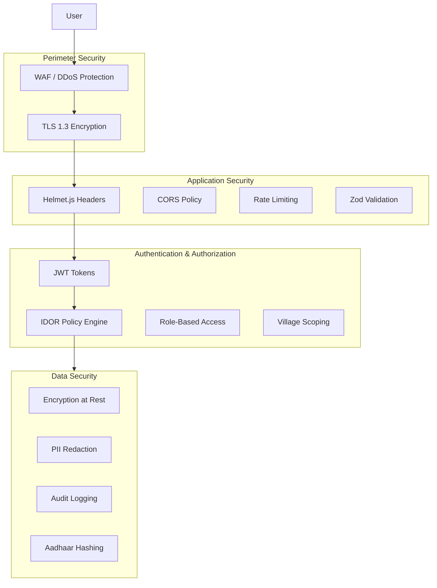

# Security & Privacy

## Introduction

SwasthAI Guardian handles sensitive healthcare data for rural populations, including personal health information (PHI), Aadhaar numbers, and clinical records. Security and privacy are foundational to the platform's design, not afterthoughts. This document outlines the security architecture, compliance standards, data protection measures, and operational security practices.

---

## Security Architecture



---

## Compliance Standards

| Standard | Jurisdiction | Implementation |
|----------|-------------|----------------|
| **DISHA 2023** | India | Active consent modal gate before data collection |
| **DPDP Act 2023** | India | Automated PII redaction layer in backend logging |
| **IT Act 2008** | India | JWT + role-based and village-scoped IDOR access controls |
| **HIPAA Aligned** | US | TLS 1.3 encryption, AWS KMS at-rest encryption, security audit logging |
| **WHO Guidelines** | International | Clinical protocols cited in 243 RAG knowledge chunks |
| **MoHFW Protocols** | India | ASHA training modules integrated into Sakhi knowledge base |
| **WCAG 2.5.5** | International | 44×44px minimum touch targets for accessibility |

---

## Data Protection

### Data Classification

| Classification | Examples | Storage | Encryption |
|---------------|----------|---------|------------|
| **Critical PHI** | Aadhaar, medical records | Aurora PostgreSQL | AES-256 at rest, TLS 1.3 in transit |
| **Telemetry** | Outbreak alerts, sync logs | DynamoDB | AES-256 at rest, TLS 1.3 in transit |
| **Audit Logs** | User actions, access events | Aurora + DynamoDB | Immutable, no TTL |
| **Session Data** | JWT tokens, refresh tokens | In-memory / DB | Signed with JWT_SECRET |

### Aadhaar Security
- **Never stored in plaintext** — SHA-256 hashed with per-deployment salt (`AADHAAR_SALT`)
- **Masked display** — Only last 4 digits visible in UI
- **Verhoeff checksum** validated before hashing to prevent transcription errors
- Salt rotation supported without data migration

### PII Redaction
The logging layer automatically redacts the following fields before any log output:

```javascript
const redactedKeys = [
  'phone', 'name', 'email', 'aadhaar',
  'password', 'token', 'patient_name',
  'patient_phone', 'child_name', 'parent_phone'
];
// All matching keys → '[REDACTED]'
```

### Encryption
- **In transit**: TLS 1.3 for all HTTP traffic (enforced by Vercel + Render)
- **At rest**: AWS KMS-managed AES-256 encryption for Aurora and DynamoDB
- **Client-side**: No plaintext secrets stored in PWA cache

---

## Authentication & Authorization

### Authentication Flow
1. User registers with phone/email + password (bcrypt hashed)
2. OTP login via phone (SMS or demo mode)
3. JWT access token (24h expiry) + refresh token (7d expiry)
4. Aadhaar QR scan for passwordless login in zero-signal zones

### Authorization Model

```
User → JWT (role + villageId) → IDOR Policy Engine → Data Access
```

| Role | Access Scope | Permissions |
|------|-------------|------------|
| **villager** | Own records only | Read/write own data |
| **ngo** | Assigned village(s) | Read/write village records |
| **admin** | All villages | Read/write all, system config |

### IDOR Prevention
All data access is filtered through a centralized `policy.js` middleware that enforces village-level scoping. A NGO worker from Village A cannot access data from Village B, even with a valid JWT.

---

## Application Security

### Headers (Helmet.js)
- Content Security Policy (configurable)
- X-Frame-Options: DENY
- X-Content-Type-Options: nosniff
- Strict-Transport-Security: max-age=63072000
- Referrer-Policy: strict-origin-when-cross-origin

### Input Validation
- **Zod schemas** on every endpoint — type coercion, length limits, regex patterns
- **HTML sanitization** — all user inputs stripped of HTML tags
- **Request size limits** — 10KB for JSON endpoints, 5MB for skin logs
- **SQL injection prevention** — parameterized queries throughout

### Rate Limiting
| Endpoint Group | Limit | Window |
|---------------|-------|--------|
| Auth (login, register) | 15 requests | 15 minutes |
| AI endpoints | 10 requests | 1 minute |
| General API | 100 requests | 15 minutes |

### CORS
- Development: All origins allowed
- Production: Whitelist of allowed origins (`.vercel.app`, `.onrender.com`, custom domains)
- Credentials support enabled for cookie-based auth

---

## Infrastructure Security

### AWS
- IAM least-privilege access (DynamoDBFullAccess only)
- Security groups restrict PostgreSQL port 5432 to application IPs
- Aurora automated backups with 7-day retention
- DynamoDB PAY_PER_REQUEST avoids resource exhaustion

### Container Security
- Non-root user in all Docker images
- Multi-stage builds exclude dev dependencies
- No secrets in Docker layers (`.dockerignore` + env vars)
- Health checks prevent routing to unhealthy containers

### Secrets Management
- All secrets via environment variables (`JWT_SECRET`, `AADHAAR_SALT`, `AGENT_SECRET`, etc.)
- Production hard-fails if `JWT_SECRET` is missing
- Demo OTP (`ALLOW_DEMO_OTP`) disallowed in production
- No `.env` files committed to version control

---

## Incident Response

### Monitoring
- **Health endpoint**: `/api/health/detailed` checks all service connections
- **Admin system view**: Real-time stack health (Aurora, DynamoDB, AI Service, IndexedDB)
- **Audit logs**: All admin actions logged with trace IDs
- **DLQ monitoring**: Failed events captured for replay analysis

### Response Plan
1. **Detection**: Automated health checks + manual monitoring
2. **Containment**: Rate limiting, IP blocking, service isolation
3. **Eradication**: Patch deployment, credential rotation
4. **Recovery**: Database restore from backup, service replay
5. **Post-mortem**: Root cause analysis, security update

---

## Best Practices

### For Developers
- Never commit secrets or `.env` files
- Use parameterized queries, not string concatenation
- Run linting and security audits before commits
- Use non-root containers in all services
- Log with structured JSON (never plaintext sensitive data)

### For Deployments
- Enable `ALLOW_DEMO_OTP` only in development
- Rotate `JWT_SECRET`, `AADHAAR_SALT`, and `AGENT_SECRET` quarterly
- Use unique secrets per deployment environment
- Configure `ALLOWED_ORIGINS` explicitly in production
- Enable Helmet.js with strict CSP in production

### For Users
- Change default passwords immediately
- Never share login credentials
- Report security incidents to the team immediately
- Use Aadhaar QR login for secure offline authentication

---

## Future Improvements

### Short-term
- [ ] Implement API key authentication for third-party integrations
- [ ] Add WebAuthn / FIDO2 support for admin logins
- [ ] Deploy WAF (CloudFlare or AWS WAF) in front of all services
- [ ] Implement database encryption at rest with customer-managed KMS keys

### Medium-term
- [ ] SOC 2 Type II audit and certification
- [ ] Bug bounty program for security researchers
- [ ] Automated dependency vulnerability scanning (Dependabot + Snyk)
- [ ] Penetration testing by independent security firm
- [ ] Implement hardware security module (HSM) for Aadhaar key management

### Long-term
- [ ] ISO 27001 certification for information security management
- [ ] HIPAA compliance certification (BA agreement)
- [ ] Zero-trust architecture with mutual TLS (mTLS) between services
- [ ] Confidential computing (AWS Nitro Enclaves) for AI inference on sensitive data
- [ ] Post-quantum cryptography readiness assessment
