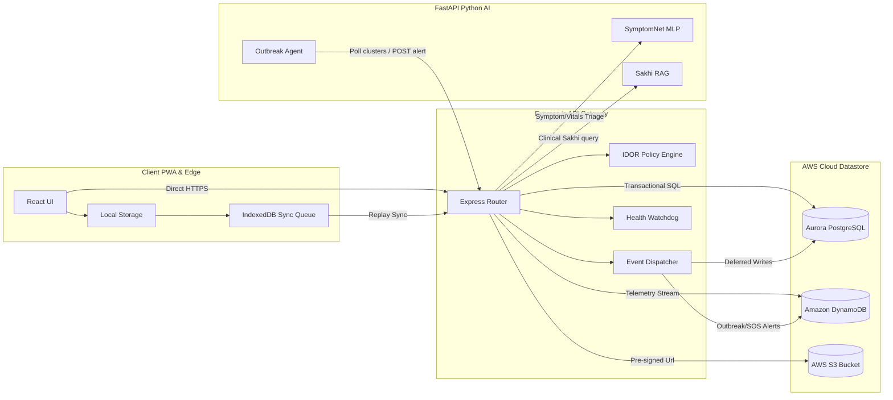
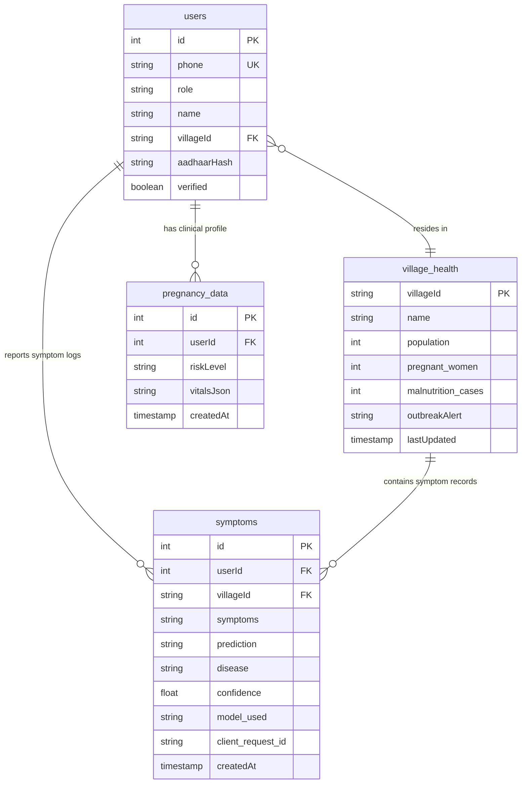

# 🏗️ System & Database Architecture — SwasthAI Guardian Platform

This document describes the high-level system architecture and database design decisions of the SwasthAI Guardian Platform, illustrating how offline-first clients, backend APIs, relational databases, NoSQL event stores, and AI microservices interact.

---

## 🏗️ High-Level Architectural Flow

The diagram below details the end-to-end data lifecycle, displaying how offline inputs sync dynamically and route to AWS cloud:



---

## 📦 Component Roles

The SwasthAI architecture is divided into three specialized tiers, built for low-latency execution and zero-connectivity resilience:

| Tier | Tech Stack | Core Capability | Offline Resilience | Data Safety & Security |
|---|---|---|---|---|
| **Client Edge** | React, Vite, IndexedDB, ONNX | **Interactive Clinician PWA** | IndexedDB Event Replay Engine & Local ONNX Triage | SHA-256 local auth hash; On-device `<200KB` image compression |
| **Backend Gateway** | Express.js, Node.js | **Unified REST API & SSE Bus** | Handles transaction sync replays dynamically | Centralized IDOR [policy.js](file:///c:/projects/SwasthAI-Guardian-Platform/backend/middleware/policy.js); 3-retry DLQ safeguard |
| **AI Microservice** | FastAPI, Python, PyTorch | **Autonomous Agents & LLMs** | Rules-based local fallbacks for edge-classification | Tokenized Groq API keys; Closed-loop agent validation |

---

### 📱 Client Edge (Vercel / React PWA)
- **Offline Sync**: Auto-replays queued events from IndexedDB upon reconnection.
- **Edge Triage**: Runs browser-side ONNX SymptomNet and offline fuzzy RAG.
- **2G Optimization**: Auto-compresses clinical photo uploads to `<200KB` on-the-fly.
- **Client Security**: Validates offline sessions via local SHA-256 credential hashes.

### ⚙️ Backend Gateway (Express.js)
- **Scope Isolation**: Centralized [policy.js](file:///c:/projects/SwasthAI-Guardian-Platform/backend/middleware/policy.js) blocks unauthorized village/role access.
- **Event Dispatcher**: Processes non-blocking event loops out-of-band with a **3-attempt retry loop**.
- **DLQ Safeguard**: Logs failed event payloads to a capped 100-item DLQ; broadcasts live alerts via SSE.
- **Watchdog Daemon**: Scans microservice health and Outbreak Agent state every 30s.

### 🤖 AI Service Layer (FastAPI / Python)
- **SymptomNet**: Multi-layered MLP classifier evaluating risks with local fallback rules.
- **Sakhi Chatbot**: High-speed multilingual clinical RAG powered by Llama-3.3-70B.
- **Outbreak Agent**: Background crawler analyzing PostgreSQL symptom trends to predict, classify, and publish verified DynamoDB outbreak records.

---

## 🗄️ Database Strategy & AWS Design Decisions

Most apps use one database for everything. SwasthAI uses a hybrid approach: a local **SQLite** database as an offline edge node and local development fallback, paired with a dual **AWS Cloud** configuration in production.

### The Local/Edge Database Strategy (SQLite Fallback)
To ensure the app remains fully functional with zero initial setup for evaluators or developers, and to simulate offline client-side sync environments, SwasthAI utilizes an embedded **SQLite** engine. 
* **Local Dev & Evaluation**: When run locally without AWS credentials, the backend automatically boots with SQLite, using the exact same schema structure as our production Aurora database.
* **Production**: When deployed to cloud environments, the backend dynamically connects to **Amazon Aurora PostgreSQL** via the `DATABASE_URL` connection pool.

---

### The AWS Production Database Strategy (Aurora + DynamoDB)

| | Amazon Aurora PostgreSQL | Amazon DynamoDB |
|---|---|---|
| **Why chosen** | ACID compliance for permanent medical records | Millisecond write latency for high-velocity telemetry |
| **The stakes** | A corrupted pregnancy record could cost a life — ACID transactions are non-negotiable | A disease cluster alert must be written in < 10ms regardless of how many villages are reporting simultaneously |
| **Access pattern** | Transactional reads/writes, relational joins, aggregations | Append-only high-throughput streams, time-series queries |
| **Data stored** | Users, symptom submissions, pregnancies, ambulance requests, government schemes | Outbreak alerts, offline sync queues, village heartbeats, emergency dispatch logs |
| **Billing model** | Provisioned capacity (db.t3.micro → scales to r6g.large) | PAY_PER_REQUEST — auto-scales to millions of writes with zero provisioning |

---

### 📊 Relational Database ERD (Amazon Aurora PostgreSQL)

Aurora acts as the consistent transactional store. The relationship chain is designed as:
`users` → `village_health` → `pregnancy_data` → `symptoms`



---

## ⚡ DynamoDB Engine Architecture

### 📊 1. Table Schema Design (GSIs & Access Patterns)

Every DynamoDB table is designed around specific access patterns to support zero-signal offline sync and rapid epidemic notifications:

| Table Name | Partition Key (PK / Hash) | Sort Key (SK / Range) | GSIs / TTL | Access Pattern & Design Purpose |
|---|---|---|---|---|
| **`outbreak_telemetry`** | `villageId` | `detectedAt` | • **GSI:** `disease-index` (`disease` + `detectedAt`) <br>• **GSI:** `district-time-index` (`districtId` + `detectedAt`) | Query disease outbreaks by trend; Query district outbreak timeline. Stores AI-detected village clusters. |
| **`sync_queues`** | `deviceId` | `queuedAt` | • **GSI:** `status-index` (`status` + `queuedAt`) | Fetch failed sync logs across the fleet. Stores offline client logs during outages. |
| **`village_node_state`** | `villageId` | *None* | • **TTL:** `expiresAt` *(Auto-expires after 7 days)* | Monitor node heartbeats. Stale nodes automatically expire from the live dashboard. |
| **`emergency_streams`** | `districtId` | `streamId` | • **GSI:** `priority-index` (`priority` + `streamId`) <br>• **GSI:** `district-date-index` (`districtDateBucket` + `timestamp`) | Filter critical P1 emergency alerts; Page emergency events chronologically. |
| **`security_audit_logs`** | `actor` | `timestamp` | • **GSI:** *None (Access Isolation)* <br>• **TTL:** *None (Retained Indefinitely)* | Query security audits by acting admin. Isolated PK lookup blocks cross-actor scanning. |

---

### 🛠️ 2. Production Hardening (Query & Code-Level Fixes)

| Fix | Before (naive) | After (production-grade) |
|---|---|---|
| **Scan → Query** | Broad table reads for command-center proof | `outbreak_telemetry.district-time-index` and `emergency_streams.district-date-index` provide bounded district/time `Query` access |
| **Dynamic districtId** | Hardcoded `'district_main'` as partition key for all records | `getDistrictId(db, villageId)` — resolves the real district via PostgreSQL join before every DynamoDB write |
| **Atomic UpdateCommand** | Full `PutCommand` on every update — race condition risk under concurrent writes | `UpdateCommand` patches only 4 owned fields — safe to call in parallel, never overwrites concurrent writes |
| **GSI Validation** | Assumed GSIs existed at runtime (silent failure if missing) | `DescribeTableCommand` on startup — compares actual vs. required GSI names; fails loudly if missing |
| **Idempotent TTL** | `setTimeout(() => UpdateTimeToLive(), 5000)` — could run multiple times | `ensureTTL()` checks for `ENABLED\|ENABLING` state before calling — idempotent and safe to re-run |

---

### The Agentic Outbreak Loop (What No Other Submission Has)

> [!TIP]
> **Autonomous Agent Architecture**: Unlike traditional dashboards requiring manual scans, SwasthAI uses a completely closed-loop background agent coordination model.

This is a fully autonomous AI agent running as a background service:

```
Every 30 minutes →
  OutbreakAgent queries Aurora PostgreSQL for village symptom clusters
  → Sends cluster JSON to Groq Llama-3.3-70b with JSON mode + 3-attempt exponential backoff
  → If LLM confidence ≥ 70%:
      Checks DynamoDB to ensure no duplicate alert exists for this village in the last 24h
      → POST to /api/admin/outbreak-alert (fails loudly at startup if AGENT_SECRET is missing)
      → Backend writes to DynamoDB outbreak_telemetry (villageId + detectedAt, with districtId for district-time GSI)
      → SSE broadcast to all connected admin dashboard sessions
      → Admin sees live Outbreak Radar update with AI reasoning trace and disease name
```

---

### PostgreSQL Schema Reference

The relational database models the full lifecycle of a rural patient's health journey:

* **`users`** — Demographic records with Aadhaar hashes (never plaintext), caste/BPL status for automatic government scheme eligibility matching.
* **`village_health`** — Patient symptom submissions linked to district geography (lat/lng + districtId) for outbreak detection.
* **`maternal_health`** — Clinical pregnancy metrics (blood pressure, blood sugar, weight, trimester) with dynamic risk-level classification (Low / Medium / High).
* **`malnutrition_cases`** — Child height/weight measurements mapped to SAM (Severe Acute Malnutrition) and MAM (Moderate Acute Malnutrition) WHO classifications.
* **`government_schemes`** — Structured JSON metadata for rural health schemes (JSY, PMMVY, Ayushman Bharat) with eligibility query parameters.
* **`ambulance_requests`** — SOS emergency event triggers with coordinate-based tracking and outcome logging.
* **`vaccination_records`** — Mission Indradhanush immunization schedule and status tracking per child.
* **`district_config`** — Per-district custom thresholds, emergency contact numbers, and automation parameters.

---

> [!IMPORTANT]
> **Why this matters**: Rural health infrastructure cannot afford either data corruption or high cloud costs. By routing critical medical records to ACID-compliant **Aurora PostgreSQL** and streaming high-frequency alerts to **DynamoDB (on-demand)**, we guarantee 100% data durability and single-digit millisecond latency while keeping operating costs close to zero.
